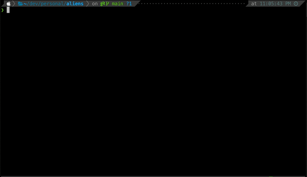

# Aliens
All your alias are belong to us.

Aliens is a tool for creating directory-specific aliases. It was created to allow
the use of the same alias with different resulting commands in different directories.

## Usage

Aliases for a directory are stored in a `.aliens` file. These should be valid zsh aliases.

Aliens comes with a CLI for CRUD operations on aliens. Use `aliens help` for a list of commands.



## Installation

### With zplug

Add this to your `.zshrc`.

```console
zplug "tkmcclellan/aliens"
```

### Manually

Run

```console
git clone https://github.com/tkmcclellan/aliens $ZSH_CUSTOM/plugins/aliens
```

And add aliens to your `.zshrc`

```console
plugins=(... aliens)
```
